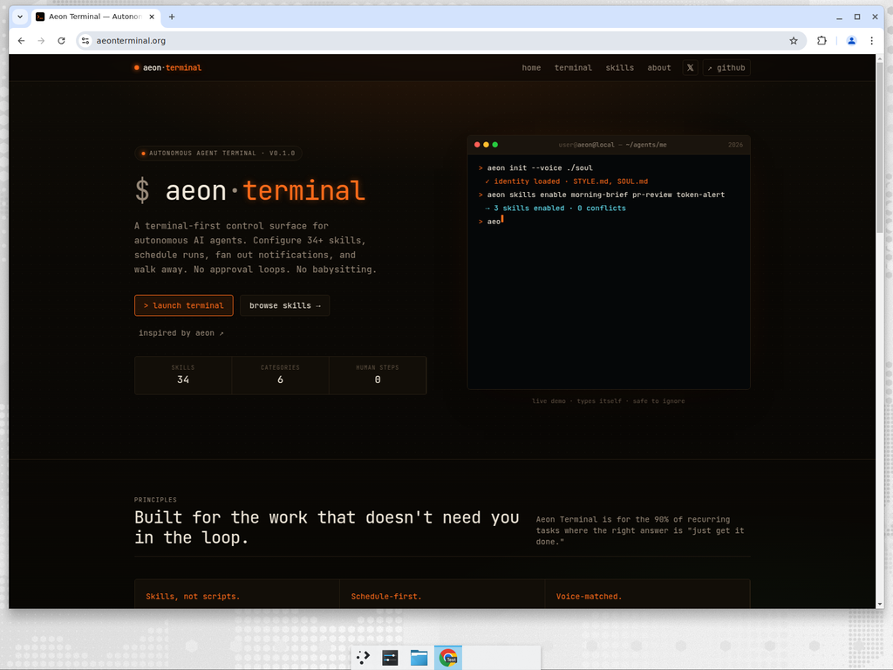
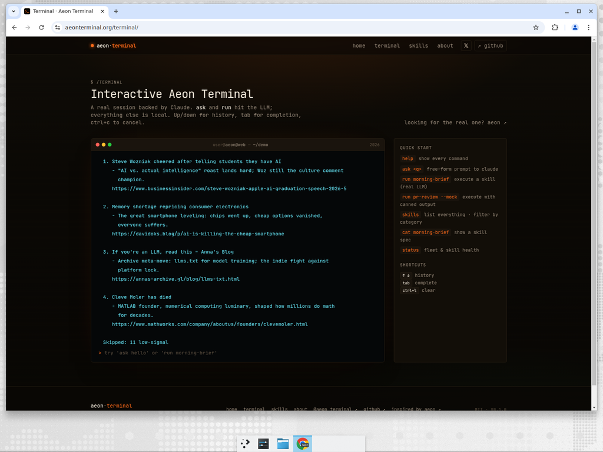
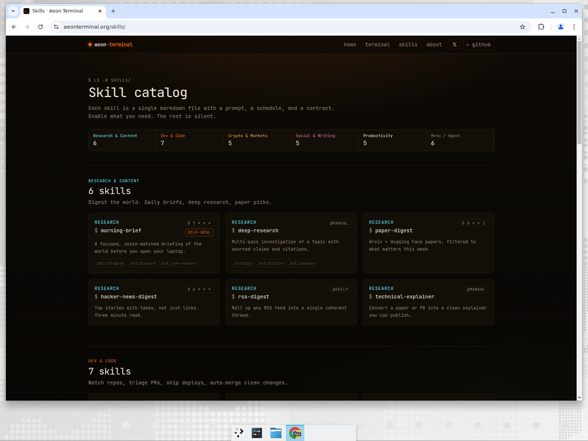
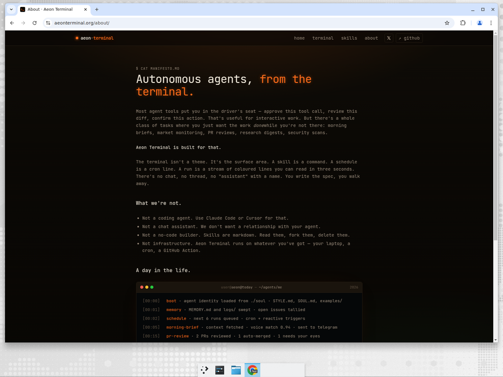

<h1 align="center">
  
  <br>
  aeon·terminal
</h1>

<p align="center">
  <strong>Autonomous agents, from the terminal.</strong><br>
  A terminal-first control surface for autonomous AI agents — backed by real Claude tool use.
</p>

<p align="center">
  <a href="https://aeonterminal.org/"></a>
  <a href="https://x.com/aeon_terminal"></a>
  <a href="https://nextjs.org"></a>
  <a href="https://react.dev"></a>
  <a href="https://tailwindcss.com"></a>
  <a href="https://www.anthropic.com/"></a>
  
</p>

<p align="center">
  <a href="https://aeonterminal.org/"><strong>aeonterminal.org</strong></a> ·
  <a href="https://aeonterminal.org/terminal/">try the terminal</a> ·
  <a href="https://aeonterminal.org/skills/">browse skills</a> ·
  <a href="https://aeonterminal.org/about/">manifesto</a>
</p>

---

## What this is

**Aeon Terminal** is a from-scratch product inspired by [aaronjmars/aeon](https://github.com/aaronjmars/aeon). Where Aeon ships a full autonomous-agent framework with GitHub Actions wiring, Aeon Terminal is a focused, terminal-first surface for the same idea — and the interactive demo is backed by a real Cloudflare Worker that talks to Claude with **actual tool use**.

- a **skill catalog** of 34 agent skills you browse like a unix tool
- an **interactive terminal** backed by Claude (`ask`, `run <skill>`) with **real** `fetch_url` + `read_rss` tools so skills like `morning-brief`, `hacker-news-digest`, `paper-digest` pull live data, not canned output
- a **manifesto** for why the most autonomous agent is the one that never asks

> Aeon Terminal is a marketing/demo site, not the production agent framework. The skill outputs are generated live by Claude with a per-skill persona prompt — many skills now fetch real RSS feeds and URLs to ground the response. See [aaronjmars/aeon](https://github.com/aaronjmars/aeon) for the full autonomous-agent framework that runs on GitHub Actions.

## Screenshots

<table>
<tr>
<td></td>
<td></td>
</tr>
<tr>
<td align="center"><sub><strong>/</strong> — Hero with live typing demo</sub></td>
<td align="center"><sub><strong>/terminal</strong> — <code>run hacker-news-digest</code> calling <code>read_rss</code> on hnrss.org</sub></td>
</tr>
<tr>
<td></td>
<td></td>
</tr>
<tr>
<td align="center"><sub><strong>/skills</strong> — 34 skills, grouped by category</sub></td>
<td align="center"><sub><strong>/about</strong> — Manifesto + day-in-the-life timeline</sub></td>
</tr>
</table>

## Pages

| Route        | What it is                                                                  |
| ------------ | --------------------------------------------------------------------------- |
| `/`          | Landing with animated hero terminal, principles, comparison, CTA.           |
| `/terminal`  | Real REPL backed by Claude — `ask`, `run <skill>`, plus local utility cmds. |
| `/skills`    | Browseable catalog of skills, grouped by category.                          |
| `/about`     | Manifesto + day-in-the-life timeline.                                       |

## Stack

- **[Next.js 16](https://nextjs.org/)** with the App Router and Turbopack.
- **React 19**.
- **[Tailwind CSS v4](https://tailwindcss.com/)** with custom design tokens via `@theme inline`.
- **TypeScript** end-to-end.
- **JetBrains Mono** as the only font.
- **[Cloudflare Workers](https://workers.cloudflare.com/)** for static assets + the `/api/exec` endpoint.
- **[Anthropic Claude](https://www.anthropic.com/)** (`claude-haiku-4-5`) for the LLM, with real tool-use for `fetch_url` and `read_rss`.

Pages prerender as static. The only runtime is a thin Cloudflare Worker that proxies a single endpoint (`/api/exec`) to Anthropic's Messages API with SSE streaming and runs the multi-turn tool loop server-side. The Anthropic key is a Worker secret (never in the repo or browser).

## Architecture

```
                                                 ┌────────────────────┐
                                                 │ Anthropic Messages │
                                                 │ claude-haiku-4-5   │
                                                 └─────────▲──────────┘
                                                           │  SSE
                                                           │
   ┌──────────┐    POST /api/exec        ┌─────────────────┴────────────┐
   │  browser │──────────────────────────▶│  Cloudflare Worker            │
   │ /terminal│   { mode, skill, prompt } │  - rate limit (30/day per IP) │
   └──────────┘◀──────────────────────────│  - per-skill system prompt    │
        ▲       SSE { text|done|error }   │  - tool loop (≤ 5 iterations) │
        │                                 │      ├── fetch_url(url)       │
        │                                 │      └── read_rss(url, limit) │
        │  /, /skills, /about (static)    └───────────────┬───────────────┘
        │                                                 │
        │                                                 ▼
        │                                       any http(s) URL
        │                                       any RSS / Atom feed
        │                                                 │
   ┌────┴──────────────────────────────────────┐          │
   │ static assets served from `out/`          │◀─────────┘
   │ Next.js 16 build, output: 'export'        │
   └───────────────────────────────────────────┘
```

**Custom domains**

| URL                                   | Behavior                                       |
| ------------------------------------- | ---------------------------------------------- |
| `aeonterminal.org`                    | Canonical apex (Worker + static assets)        |
| `terminal.aeonterminal.org`           | → 302 → `aeonterminal.org/terminal/`           |
| `aeon-terminal.drophyte99.workers.dev`| Workers.dev fallback (same Worker)             |

## Quick start

```bash
git clone https://github.com/aeonterminal/aeon-terminal
cd aeon-terminal
npm install
npm run dev   # → http://localhost:3000
```

### Scripts

| Command          | What it does                                |
| ---------------- | ------------------------------------------- |
| `npm run dev`    | Start the dev server on port 3000.          |
| `npm run build`  | Production build (Turbopack, static pages). |
| `npm run start`  | Serve the production build.                 |
| `npm run lint`   | ESLint via the flat config.                 |

## Deploy

The site is one Cloudflare Worker that serves both static assets and the `/api/exec` endpoint.

1. **Push to GitHub** — connect the repo to Cloudflare Workers under **Workers & Pages → Create application → Connect to Git**.

2. **Build settings**
   ```
   Build command:   npm run build
   Output directory: out
   Deploy command:  npx wrangler deploy
   ```

3. **Add the Anthropic key as a Worker secret**
   - Workers & Pages → your worker → **Settings → Variables and Secrets**
   - Type: **Secret**
   - Name: `ANTHROPIC_API_KEY`
   - Value: your Anthropic API key

4. **Custom domain** (optional)
   - Settings → **Domains & Routes** → **+ Add → Custom Domain** → enter the subdomain. Cloudflare provisions DNS + SSL automatically.

Every push to `main` triggers an automatic redeploy.

## Interactive terminal

The `/terminal` page is a real REPL. Up/down for history, tab for completion, ctrl+c to cancel a stream.

```
> ask what's at https://example.com
» fetch_url https://example.com
  · 0.5KB · 200
The page title is "Example Domain".

> run hacker-news-digest
» read_rss https://hnrss.org/frontpage?count=15
  · 15 items
TOP HACKER NEWS STORIES
1. ...
```

Commands:

| Command                 | What it does                                                |
| ----------------------- | ----------------------------------------------------------- |
| `ask <q>`               | Free-form prompt to Claude (real LLM, real tools)           |
| `run <skill>`           | Execute a skill with its per-skill persona prompt           |
| `run <skill> --mock`    | Execute with canned offline output                          |
| `skills [category]`     | List skills, optionally filtered                            |
| `cat <skill>`           | Show a skill's spec                                         |
| `status`                | Fleet & skill health                                        |
| `help`                  | Show every command                                          |
| `ctrl+c`                | Cancel an in-flight stream                                  |
| `ctrl+l`                | Clear the buffer                                            |

## Repo layout

```
src/
  app/
    page.tsx              # /
    terminal/page.tsx     # /terminal
    skills/page.tsx       # /skills
    about/page.tsx        # /about
    icon.svg              # favicon
    apple-icon.svg
    opengraph-image.tsx   # /opengraph-image (1200×630)
    layout.tsx            # root layout (header/footer)
    globals.css           # design tokens, CRT styles
  components/
    site-header.tsx
    site-footer.tsx
    terminal-window.tsx       # window chrome (traffic-lights, title)
    hero-terminal.tsx         # animated typing demo (client)
    interactive-terminal.tsx  # REPL (client)
    skill-card.tsx
    ascii-logo.tsx
  lib/
    skills.ts             # skill catalog data
worker.js                 # Cloudflare Worker: /api/exec + tool loop
wrangler.toml             # Worker config (assets binding, run_worker_first)
docs/screenshots/         # README assets
public/                   # x-avatar.png, x-avatar.svg, favicons
```

## Adding a skill

`src/lib/skills.ts` exports a typed `SKILLS` array. Add an entry:

```ts
{
  slug: "new-skill",
  name: "new-skill",
  category: "research",            // research | dev | crypto | social | productivity | meta
  summary: "What it does in one line.",
  cron: "0 6 * * *",               // or "@manual" / "@reactive" / "@daily"
  inputs: ["topic"],               // optional
  outputs: ["telegram"],           // optional
  selfHealing: true,               // optional
}
```

The skill will appear on `/skills`, get a card on the home page if you add it to `FEATURED_SLUGS`, and be runnable via `run new-skill` in the interactive terminal.

To give the skill a real persona that can call tools, also add an entry to `SKILL_REGISTRY` in `worker.js` — keep the prompt short and mention `fetch_url` / `read_rss` when the skill should hit the network.

## Design notes

- **Mono everywhere.** The whole site is set in JetBrains Mono.
- **Aeon bicolor.** Primary `#FF6B1A` (orange), secondary `#43C165` (green) — borrowed from the Evangelion-inspired palette in [aaronjmars/aeon](https://github.com/aaronjmars/aeon). Foreground `#f0e8da` on a warm near-black `#0a0805`. Everything else is muted gray.
- **Subtle CRT.** Scanline overlay + radial orange glow at the top. Designed to feel like a TUI, not look like one.
- **Reduced-motion aware.** All typing/blink animations respect `prefers-reduced-motion`.

## Safety

The Worker tools enforce strict boundaries:

- `fetch_url` blocks `localhost`, `127.0.0.0/8`, `10.0.0.0/8`, `172.16.0.0/12`, `192.168.0.0/16`, and `169.254.0.0/16`.
- 8 second fetch timeout per tool call.
- 5 KB max response body returned to Claude (truncated).
- Hard cap of 5 tool iterations per request.
- Rate limit: 30 `/api/exec` calls per IP per day (Cloudflare Cache API).
- `ANTHROPIC_API_KEY` only lives in a Worker secret — never in the repo, never in the browser.

## License

MIT. See [`LICENSE`](LICENSE).

## Credits

- Conceptually inspired by [aaronjmars/aeon](https://github.com/aaronjmars/aeon).
- Built with Next.js, React, Tailwind CSS, Cloudflare Workers, and Claude.
- Follow [@aeon_terminal](https://x.com/aeon_terminal) on X.
